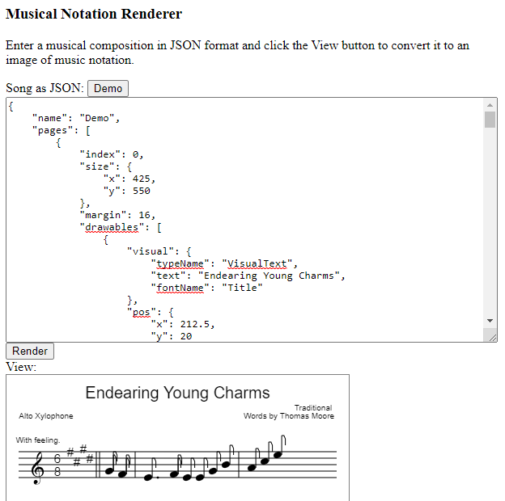

Music Notation Renderer
=======================

The JavaScript code in this repository allows the user to generate an image of musical notation from a song specified in JSON format.

As of this writing, it is a work in progress.

Running
-------

To run the program, open the file Source/MusicNotationRenderer.html in a web browser that runs JavaScript.

Note that, if the program is run directly from the filesystem rather than a web server, the symbols based on image files, such as the G clef, will not render, unless the browser is run in such a way as to allow file access from the file:// protocol.  In Google Chrome, this can be enabled by running with the --allow-file-access-from-files command-line switch.